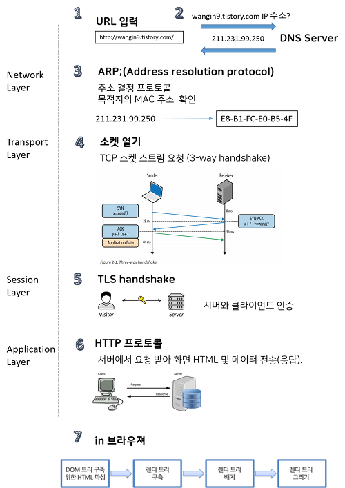

# Topics

-   서버와 클라이언트, 그리고 웹 브라우저
-   인터넷을 구성하는 여러 가지 프로토콜
    -   IP
    -   TCP
    -   HTTP
-   DNS

# Checklist

-   인터넷은 어떻게 동작하나요? OSI 7 Layer에 입각하여 설명해 보세요.
-   우리가 브라우저의 주소 창에 www.knowre.com 을 쳤을 때, 어떤 과정을 통해 노리의 서버 주소를 알게 되나요?

## OSI(Open Systems Interconnection Reference Model) 7 Layers

### 개요

ISO(국제 표준화 기구)와 International Telegraph and Telephone Consultative Committee(국제 전신 자문 위원회)에서 각각 정의해놓은 **네트워킹 모델을 정의해놓은 문서**를 통합하여 **Open Systems Interconnection Reference Model(개방형 시스템 상호연결 참조 모델)**이라는 표준을 만들었다.

OSI는 2가지 주된 구성 요소가 있다. `추상형 네트워킹 모델`, `특정한 프로토콜들의 집합`

추상형 네트워킹 모델은 기본 참조 모델이자 7 계층 모델을 이야기한다.

7 Layers of the OSI Basic Reference Model

    1. Physical Layer
    2. Data Link Layer
    3. Network Layer
    4. Transport Layer
    5. Session Layer
    6. Presentation Layer
    7. Application Layer

계층은 1번부터 7번까지 오름차순이다.

각 계층은 프로토콜을 기능별로 나눈 것이다. 각 계층은 하위 계층의 기능만을 이용하고, 상위 계층에게 기능을 제공한다.

`프로토콜 스텍`은 계층들로 구성되는 프로토콜 시스템이 구현된 시스템을 가리킨다.

### 계층의 기능

1.  Physical Layer(물리 계층)

    물리 계층은 OSI 7 Layers에서 가장 낮은 계층이다.

    물리 계층은 네트워크의 기본 네트워크 하드웨어 전송 기술로 구성된다.

    네트워크의 높은 수준의 기능의 논리 데이터 구조를 기초로 하는 필수 계층이다.

    하드웨어 기술이 접목되어 있기 때문에 OSI 설계에서 가장 복잡한 계층으로 간주된다.

    하드웨어 장비의 예:

        네트워크 어뎁터(컴퓨터를 네트워크에 연결시키기 위한 장치)
        리피터(신호를 증폭 시켜주는 장치)
        네트워크 허브(여러 대의 컴퓨터, 네트워크 장비를 연결하는 장치)
        모뎀(아날로그 <-> 디지털 상호 신호 변환 장치)

2.  Data Link Layer

    데이터 링크 계층은 장치 간 신호를 전달하는 물리 계층을 이용하여 네트워크 상의 주변 장치들 간 데이터를 전송한다.

    데이터 링크 계층의 두 가지 주요 기능이 있다.

        주소 할당: 물리 계층으로부터 받은 신호들이 네트워크 상의 장치에 올바르게 안착할 수 있도록 한다
        오류 감지: 신호가 전달되는 동안 오류가 포함되는지 감지한다. 만약 오류가 감지되면 데이터 링크 계층은 해당 데이터를 폐기한다

3.  Network Layer

    네트워크 계층은 라우팅<sup>[[1]](#routing)</sup>을 포함한 패킷 포워딩을 담당한다.  
    네트워크 계층의 기능은 크게 3가지다.

    -   연결 모델: 비연결 지향 통신
    -   호스트 주소 할당: 네트워크 내 모든 호스트는 고유 주소를 갖추어야 한다.
    -   메시지 포워딩: 많은 네트워크가 서브네트워크로 분산되어 있고, 다른 네트워크에 연결되어 있기 때문에 네트워크끼리 패킷을 전달하기 위해 특별한 호스트(gateways<sup>[[2]](#gateways)</sup>, routers)를 사용한다.

4.  Transport Layer

    기본적으로 `END USER to END USER`

    전송 계층은 계층 구조의 네트워크 구성 요소와 프로토콜 내에서 송신자와 수신자를 연결하는 통신 서비스를 제공한다.

    전송 계층은 인터넷의 기반인 TCP/IP<sup>[[3]](#TCP/IP)</sup> 참조 모델과 일반적인 네트워크 모델인 OSI 모두 포함하고 있다.

5.  Session Layer

    X.225(ISO 8327)<sup>[[4]](#X.225)</sup>과 같은 세션 계층 프로토콜을 말한다. 오랜 시간 연결이 되지 않으면 세션 계층 프로토콜은 연결을 닫고 다시 연결을 재개한다.

    양 끝단의 응용 프로세스가 통신을 관리하기 위한 방법을 제공한다.

    동시 송수신 방식(duplex), 반이중 방식(half-duplex), 전이중 방식(full duplex)의 통신과 함께, 체크 포인팅과 유휴, 종료, 다시 시작 과정 등을 수행한다. TCP/IP 세션을 만들고 없애는 책임을 진다.

    통신하는 사용자들을 동기화하고 오류 복구 명령들을 일괄적으로 다룬다.

6.  Presentation Layer

    코드 간의 번역을 담당하여 사용자 시스템에서 데이터의 형식상 차이를 다루는 부담을 응용 계층으로부터 덜어 준다.

    MIME<sup>[[5]](#MIME)</sup> 인코딩이나 암호화 등의 동작이 이 계층에서 이루어진다.

    일종의 네트워크의 데이터 번역자

7.  Application Layer

    응용 계층은 네트워크를 통하는 프로세스 간 통신 접속을 위해 설계되어 통신 프로토콜과 방식을 위해 보유된 추상 계층이다.

    전송 계층 프로토콜을 사용하여 호스트 간 연결을 확립한다.

    OSI 모델에서 응용 계층은 사용자 인터페이스이다.

    OSI 모델에서 응용 계층은 사람이 인식하고 Presentation Layer와 상호 작용할 수 있는 데이터와 그림을 사용자에게 보여주는 역할을 맡는다.

## Server, Client and Web Browser

1.  Server
    통상적으로 웹에 연결된 컴퓨터를 말한다. 서버는 웹페이지, 사이트, 앱 등을 저장하는 컴퓨터이다.

    클라이언트가 웹페이지, 사이트, 앱에 접근하려고 할 때 서버로부터 클라이언트의 장치로 사용자의 웹 브라우저에서 보여지기 위한 웹페이지의 사본이 다운로드된다.

2.  Client

    클라이언트 역시 웹에 연결된 컴퓨터를 말한다.

    일반적인 웹 사용자의 인터넷이 연결된 장치들과 이런 장치들에서 이용 가능한 웹에 접근하는 소프트웨어이다.

3.  Web Browser

    사용자가 선택한 자원(Resource)을 서버에 요청하고, 표시하는 기능을 가진 프로그램이다.

## Protocols for Internet

Protocol, 프로토콜은 규약이라는 뜻이다. 그렇다면 인터넷에서 사용되는 규약은, 서로 다른 기기들 간의 데이터 교환에 필요한 일종의 표준화된 통신 규약을 말한다. 통신 프로토콜은 리본적으로 하드웨어, 소프트웨어 모두를 규정한다.

프로토콜은 물리적 | 논리적 측면으로 구성되어 있다.

       물리적: 자료 전송에 쓰이는 전송 매체, 접속용 단자 및 전송 신호, 회선 규격 등
       논리적: 프레임 구성, 프레임 안에 있는 각 항목의 뜻과 기능, 자료 전송의 절차 등
           * 폐쇄적인 프로토콜: 자사 장치들끼리 통신하기 위한 독자적인 통신 규약이며, 자세한 규격이 공개되어 있지 않아서 크래킹 위협에 상대적으로 안전하다.
           * 공개된 범용 프로토콜: 여러 장치들에 쓰이는 널리 알려진 규격이며, 규격이 널리 공개되어 있기 때문에 컴퓨터와 네트워크 크래킹에 취약한 편이다.

Protocol 종류

-   IP

    -   송신 호스트와 수신 호스트가 패킷 교환 네트워크에서 정보를 주고 받는데 사용하는 정보 위주의 규약
    -   패킷<sup>[[6]](#패킷)</sup> 혹은 데이터그램이라고 하는 덩어리로 나뉘어 전송된다.
    -   비신뢰성, 비연결성을 특징으로 갖는다. 보낸 정보가 제대로 도착했는지를 보장하지 않는다.

-   TCP

    -   Transmission Control Protocal, 전송 제어 프로토콜
    -   근거리 통신망이나 인트라넷, 인터넷에 연결된 컴퓨터에서 실행되는 프로그램 간에 일련의 옥텟을 안정적으로, 순서대로, 에러 없이 교환할 수 있도록 한다.
    -   Trnasport Layer, 전송 계층에 위치한다.
    -   TCP의 안정성이 필요 없는 경우, UDP(User Datagram Protocol)을 사용한다. 이것은 전달 확인, 순차 보장 기능이 없는 대신 오버헤드가 적고, 지연시간이 짧다.
    -   TCP는 데이터 스트림으로부터 데이터를 받아 들여 청크 단위로 분할하고, TCP 헤더를 덧붙여 TCP 세그먼트(패킷이 아니다)를 생성한다.
    -   연결 절차:

            Three Way Handshake

            1. 상대에게 통신을 하고 싶다는 메시지를 보낸다. (SYN, Synchronize Sequence Number)
            2. 상대는 응답 + 통신 준비 되었다는 메시지를 보낸다. (SYN + ACK)
            3. 2번에서 받은 메시지에 응답을 보낸다. (ACK, Acknowledgement)

    -   신뢰성 보장, 흐름 제어(Flow Control):

            TCP의 헤더파일을 살펴보면 [목적지 주소], [확인 응답], [오류 검출 및 복원], [실제 데이터] 등이 포함된다.
            여기서 UDP와 구분되는 것이 [확인 응답](Acknowledgement)아다.
            [확인 응답]을 사용해 송수신 시 계속 확인하기 때문에 데이터 신뢰도가 높다.
            하지만 데이터 용량이 증가하기 때문에 수신 속도가 떨어진다는 단점이 있다.

    -   혼잡 제어(Congestion Control)

            사용자 수가 늘어나다보니 네트워크 회선이 부하를 감당하지 못하고, 네트워크 기기(라우터 등)에 무한히 몰려 사망하는 경우가 발생하기 시작했다.
            쉽게 말해, 밑 빠진 독에 물을 붙는데 물이 빠지는 속도보다 채워지는 속도가 더 빨라서 독이 넘쳐버리는 것.

            문제점

            1. 라우터의 저장에는 한계 용량이 있다. 그렇기 때문에 그 한계가 넘는 데이터가 쌓일 경우 저장되지 못한 데이터들은 손실된다.
            2. 데이터의 안정성 때문에 만약 응답을 받지 못했다면, 재요청을 계속해서 보낸다. 그럴 경우, 버려지는 세그먼트의 낭비가 생긴다.

            해결점

            애초에 세그먼트를 전송할 때, 한정적인 양을 전송한다. 그리고 정상적으로 응답이 온다면 서서히 그 양을 늘린다. 그러다 만약 데이터를 제대로 받지 못했다면 전송하는 양을 확 줄인다. 그리고 정상 궤도에 다시 진입할 경우 그 양을 조금씩 늘린다.
            이 방법을 사용하면 라우터에 데이터가 쌓일 경우, 그것들을 우선적으로 처리할 수 있는 시간을 기다려주는 효과가 생긴다.
            따라서 여러 명의 사용자가 접속할 경우, 개개인이 속도에서 약간의 손해를 보게 되지만 "사망"은 발생하지 않게 된다.

*   HTTP(HTTPS)

    -   WWW 상에서 정보를 주고 받을 수 있는 프로토콜이다.
    -   클라이언트와 서버 사이에 이루어지는 요청 / 응답 프로토콜이다.
    -   주로 HTML 문서를 주고 받는데 사용된다.
    -   TCP와 UDP를 사용하며 80 포트를 사용한다.
    -   흐름 예시: `브라우저 -> (HTTP를 이용, 웹페이지 요청) -> 서버 -> (HTTP를 이용, 해당 웹페이지) -> 클라이언트`
    -   HTTPS: HTTP의 보안이 강화된 버전이다. SSL이나 TLS 프로토콜을 통해 세션 데이터를 암호화한다. 기본 포트는 443이다.

*   SSH

    -   Secure Shell
    -   네트워크 상의 다른 컴퓨터에 로그인하거나 원격 시스템에서 명령을 실행하고 다른 시스템으로 파일을 복사할 수 있도록 해주는 응용 프로그램, 프로토콜이다.
    -   강력한 인증 방법으로 안전하게 네트워크 상에서 통신할 수 있는 기능을 제공한다.
    -   기본적으로 22번 포트를 사용한다.
    -   암호화 기법을 사용하기 때문에 통신이 노출되어도 그 내용을 파악할 수 없다.

*   SSL(TLS의 과거 명칭)
    -   컴퓨터 네트워크에 통신 보안을 제공하기 위해 설계된 암호 규약
    -   통신 과정에서 전송 계층의 End-to-End 사이의 보안과 데이터 무결성을 확보해준다.
    -   기본 절차
        1.  지원 가능한 알고리즘 서로 교환
        2.  키 교환, 인증
        3.  대칭키 암호로 암호화하고 메시지 인증
    -   송수신자 사이에서 데이터 탈취 예방에 매우 강하다.
    -   하지만 송수신자 간의 데이터 교환에 관해서는 약하다. 예를 들어, 개인정보 유출을 예방할 수는 없다.

## DNS

### 개요

Domain Name System

소위 `인터넷의 전화번호부(분산형 데이터베이스)`

사람들은 도메인 이름을 통해 온라인 정보에 접근한다.

인터넷은 2개의 주요 namespace를 관리한다. 첫째는 Domain Name, 둘째는 IP Address이다.

DNS는 여기서 Domain Name을 관리하고 상호 간의 변환 서비스를 제공한다.

웹 브라우저는 IP 주소를 이용한다. DNS는 도메인 이름을 IP 주소로 변환시켜서 해당 인터넷 Resource에 접근한다.

예를 들어, `www.knowre.com => 192.168.1.0`과 같은 IP 주소로 변환하고 라우팅 정보를 제공한다.

인터넷에 연결된 각각의 장비는 고유의 IP 주소를 갖고 있으며, 다른 장치에서 이것을 보고 해당 장치를 찾을 수 있다.

### 작동 방식

DNS의 작동 방식을 이해하기 위해 DNS 쿼리가 반드시 거쳐야 하는 몇 가지의 하드웨어 컴포넌트를 알아야 한다.

웹 페이지가 로딩될 때 4가지의 DNS 서버가 관여한다.

    	1. DNS Resursor
    	2. Root Nameserver
    	3. TLD Nameserver
    	4. Authoritative nameserver

이들은 (특별히 캐싱이 되지 않았다면) DNS 조회에서 IP 주소를 도메인 이름으로 변환하기 위해 함께 수행한다.

-   #### DNS Recursor

    Client와 DNS 서버와의 일종의 중재자 역할을 담당한다.

    Web Client로 부터 Query를 받으면 캐시된 데이터가 있으면 해당 데이터로 응답한다.

    만약 캐시된 데이터가 없다면, Root Nameserver, TLD Nameserver, Authoritative Nameserver로 순서대로 요청을 보낸 뒤, 응답 받은 IP 주소를 Client에게 전송한다.

    이 과정에서 Authoritative Namserver로부터 받은 정보를 캐시해두고, 다른 Client로부터 같은 요청이 올 경우, 캐시된 데이터로 응답한다.

-   #### Root Nameserver

    13 DNS Root Nameserver는 모든 Recursor가 알 수 있으며 Recursive Resolver의 퀘스트가 도착하는 첫번째 단계이다.

    Root Nameserver는 도메인 이름을 포함한 쿼리를 수신한다.

    그리고 도메인의 확장자를 기반으로 TLD Nameserver로 연결시킨다.

    위에서 언급한 바, 13개의 DNS Root Nameserver가 있다고 해서 Root Nameserver System에 13개의 기계 장치가 있다는 것은 아니다.

    13개 종류의 Root Namerserver를 말하는 것이다.

    전세계에 각각의 복사본들이 있고, Anycast Routing<sup>[[7]](#Anycast_Routing)</sup>을 통해 빠른 응답을 한다.

-   #### TLD Nameserver

    Top Level Domain Server

    일반적인 도메인 확장자 예를 들어, `.com`, `.net`, `net` 이외의 url에서 `.` 이후에 오는 확장자를 공유하는 도메인 이름을 관리한다.

    만약 `.com TLD Nameserver`라면 `.com`으로 끝나는 모든 도메인 이름을 가진 웹 사이트의 정보를 갖고 있다.

    다시 처음으로 돌아가서 만약 Client가 어떤 요청을 보내면 Recursor는 먼저 Root Nameserver로 쿼리 요청을 보낸다. Root Nameserver는 url의 확장자를 기반으로 해당 TLD Nameserver에 요청을 보내고, TLD Nameserver는 해당 Authoritative Nameserver를 가리키는 응답을 보낸다.

    TLD Server는 두 개의 그룹으로 나뉘어져 있다.

    -   Generic-top-level Domain: 특정 국가와 관계가 있지 않은, `.org`, `.net`, '`.edu`, `.com`, `.gov`와 같은 것들
    -   Country code top-level Domain: 특정 국가, 주와 관련 있는 도메인, `.uk`, `.us`, `.ru`, `.jp`와 같은 것들

-   #### Authoritative Nameserver

    Authoritative Nameserver는 해당 도메인 이름에 대한 정보를 갖고 있다.

    응답으로 <u>DNS A Record</u><sup>[[9]](#DNS_A_Record)</sup>서 찾은 IP 주소를 보낸다.

    만약 해당 도메인이 <u>CNAME Record(alias)</u><sup>[[10]](#CNAME_Record)</sup>라면 Alias Domain을 Recursor에게 전달하고 새로운 DNS 조회가 한번 더 발생한다.

## 인터넷은 어떻게 동작할까

### 네트워크

만약 두 대의 컴퓨터가 서로 통신해야 한다고 가정해보자. 이때 사용할 수 있는 방법은 크게 두 가지이다. 물리적인(케이블 등) 연결 혹은 무선(WiFi, Bluetooth) 연결.

물리적으로 컴퓨터를 연결한다면 만약 2대가 아닌 10대의 컴퓨터를 연결시킨다고 가정했을 때, 45개의 케이블이 필요하다. 만약 100대라면, 1000대라면...?

하지만 라우터(컴퓨터에서 보낸 메시지가 올바른 목적지 컴퓨터로 도착하는지 확인한다) 특수한 소형 컴퓨터를 사용하면 10대의 컴퓨터가 모두 사용하는 한 개의 라우터, 즉 10개의 케이블로 한 개의 라우터에 연결할 수 있다.

그래도 아직 수백, 수천 대의 컴퓨터를 연결하는 것에는 무리가 있다. 그래서 라우터끼리의 연결도 가능하다. 라우터와 라우터끼리의 연결로 조금 더 효율적으롷 많은 컴퓨터 간의 네트워크를 형성할 수 있다.

이제 만약 원격으로 모든 라우터를 연결한다고 가정해보자. 전화기 기반의 매우 범용적인 시설을 모뎀이라는 장비를 활용해서 우리의 네트워크 정보를 송, 수신할 수 있다.

이제 우리의 네트워크는 전화 시설에 연결되고 도달하려는 네트워크로 메시지를 보낼 수 있다.

이 과정에서 Internet Service Provider(인터넷 서비스 제공 업체)가 우리의 네트워크 메시지를 다른 네트워크의 라우터로 엑세스해 전송한다.

### 인터넷, 웹

네트워크에 연결된 컴퓨터 간의 메시지 송, 수신을 위해 서로의 고유한 주소가 필요하다. 이것을 IP 주소라고 한다.

IP 주소는 예를 들어, `192.168.2.10` 이런 식으로 구성되어 있기 때문에 사람이 기억하기에 어렵다.

따라서 도메인 이름, 예를 들어 `google.com`과 같은 이름을 사용한다.

### 브라우저의 주소 창에 www.knowre.com 을 쳤을 때, 어떤 과정이 일어날까

-   #### 기본적인 흐름
    

1. URL 입력
2. DNS Server
3. Address Resolution Protocol
4. 소켓 열기
5. TLS Handshake
6. HTTP Protocol
7. Browser

-   #### URL 입력

    1. 브라우저의 검색 창에 `www.knowre.com`을 입력한다면 키보드의 각 스위치 상태를 관리하는 논리 회로에 전기적 잡을을 일으키고, 인터럽트 신호를 발생시킨다.
    2. 인터럽트 신호는 인터럽트 이벤트를 발생시키고, OS X의 WindowServer 프로세스에 전달된다.
    3. WindowServer는 이벤트를 적절한 이벤트 큐에 전송한다.
    4. 이벤트 큐에서 `mach_ipc_dispatch` 함수를 호출할 권한이 있는 스레드에 의해 읽힌다.
    5. 이제 브라우저는 URL 정보를 갖는다.
    6. 만약 Protocol이나 Domain Name이 주어지지 않았다면, 브라우저는 해당 정보를 브라우저의 기본 웹 검색 엔진에 넘긴다.
    7. 브라우저는 `HTTP Strict Transport Security` 리스트를 점검해 HTTPS 요청을 보낼지 여부를 판단한다.

-   #### DNS 검색

    1.  브라우저는 도메인이 캐시되어 있는지 확인한다.
    2.  만약 없다면, `gethostbyname` 라이브러리 함수를 호출한다.
    3.  `gethostbyname`을 통해 로컬의 hosts 파일에서 참조할 수 있는지를 확인한다.
    4.  만약 찾지 못한다면, 네트워크 스텍에서 정의된 DNS 서버에 요청을 보낸다.
    5.  만약 DNS 서버가 같은 서브넷에 존재한다면, 이 네트워크 라이브러리는 DNS 서버에 대해 `ARP Process`를 거친다.
    6.  만약 DNS 서버가 다른 서브넷에 존대한다면, 이 네트워크 라이브러리는 기본 게이트웨이 IP에 대해 `ARP Process`를 거친다.

-   #### ARP Process: Address Resolution Protocol

    1. ARP 브로드캐스트를 보내는데 먼저 네트워크 스택 라이브러리가 검색할 목적지 IP의 주소와 사용하는 인터페이스의 MAC<sup>[[11]](#MAC)</sup> 주소를 알아야 한다.
    2. ARP 캐시가 목적지 IP의 ARP 항목을 갖고 있는지 점검한다. 만약 있다면 `목적지 IP = MAC`
    3. 만약 없다면,
        - 라우트 테이블을 검색해서 목적지 IP 주소가 로컬 라우트 테이블의 서브넷<sup>[[12]](#Subnet)</sup>에 존재하는지 본다.
        - 존재할 경우: 그 서브넷에 속하는 인터페이스를 활용한다.
        - 존재하지 않을 경우: 기본 게이트웨이의 서브넷에 속하는 인터페이스를 활용한다.
        - 선택된 네트워크 인터페이스의 MAC 주소가 검색된다.
    4. 네트워크 라이브러리는 Data Link 계층을 통해 ARP 요청을 보낸다.

        ```
        ARP Request:
        Sender MAC: interface:mac:address:here
        Sender IP: interface.ip.goes.here
        Target MAC: FF:FF:FF:FF:FF:FF (Broadcast)
        Target IP: target.ip.goes.here
        ```

    5. 응답으로 네트워크 라이브러리는 DNS 서버나 DNS 프로세스를 재개할 수 있는 기본 게이트웨이 중 하나의 IP 주소를 갖게 된다.

        ```
        ARP Reply:
        Sender MAC: target:mac:address:here
        Sender IP: target.ip.goes.here
        Target MAC: interface:mac:address:here
        Target IP: interface:ip.goes.here
        ```

-   #### 소켓 열기

    1.  브라우저가 목적지 서버의 IP 주소를 받으면, 거기서 호스트명과 포트 번호를 뽑아 `socket`이라는 시스템 라이브러리를 호출해 TCP 소켓 스트림을 요청한다.
        -   이 요청은 TCP 세그먼트가 제작되는 Transport 레이어로 전달된다. 목적지 포트는 헤더에 더해지고, 출발지 포트는 커널의 동적 포트 범위에서 선택된다.
        -   이 세그먼트는 추가적인 IP 헤더를 덧씌우는 Network 레이어로 보내진다. 지금의 머신뿐 아니라 목적지 서버의 IP 주소도 담아 "패킷"을 만든다.
        -   패킷은 곧 Link 레이어에 도착한다. 머신 NIC의 MAC 주소에 게이트웨이의 MAC 주소까지 포함한 프레임 헤더가 더해진다.
        -   만약 커널이 게이트웨이의 MAC 주소를 모른다면, ARP 쿼리를 broadcast해서 찾는다.
    2.  이 지점에서 패킷은 다음 중 하나로 전송될 준비를 한다.
        -   이더넷
        -   와이파이
        -   무선 통신 네트워크
    3.  패킷은 모뎀을 통해 아날로그 신호로 변환된다.
    4.  패킷은 로컬 서브넷을 관리하는 라우터에 도착하고, 여기서부터 목적지 서버까지 가게 된다.
    5.  중간에 지나치는 라우터는 IP 헤더로부터 목적지 주소를 추출해서 적절한 다음 단계까지 이어준다.
    6.  IP 헤더 내의 TTL(Time To Live) 영역은 라우터를 하나씩 지날 때마다 감소된다.
    7.  만약 TTL 영역이 0이 되거나, 도달한 라우터의 큐에 자리가 없을 때 패킷은 드랍 된다.

-   #### TLS HANDSHAKE

    1. 클라이언트 컴퓨터가 자신의 TLS 버전, 암호 알고리즘 목록, 사용 가능한 압축 방식을 `ClientHello` 메시지에 담아 서버로 보낸다.
    2. 서버는 클라이언트에게 TLS 버전, 암호 알고리즘, 압축 방식, CA가 사인한 공개 인증서를 `ServerHello` 메시지에 담아 답장한다.  
       (여기서 인증서는 대칭키가 생성되기 전까지 클라이언트가 나머지 handshake 과정을 암호화 하는 데에 쓸 공개키를 담고 있다)
    3. 클라이언트는 서버 측 디지털 인증서가 유효한지, 신뢰할 수 있는 CA 목록을 통해 확인한다. 만약 신뢰성이 확보되면 클라이언트는 의사 난수(pseudoo-random) 바이트를 생성해 서버의 공개키로 암호화한다.(이 난수 바이트는 대칭키를 정하는 데에 사용된다)
    4. 서버는 난수 바이트를 자기 개인키로 복호화해 대칭 마스터키 생성에 활용된다.
    5. 클라이언트는 `Finished` 메시지를 서버에 보내면서, 지금까지의 교환 내역을 해시한 값을 대칭키로 암호화하여 담습니다.
    6. 서버는 스스로도 해시를 생성해 클라이언트에서 도착한 값과 일치하는지 봅니다. 일치하면, 서버도 대칭키를 통해 암호화한 `Finished` 메시지를 클라이언트에 보낸다.
    7. 이제 TLS 세션이 대칭키로 암호화된 어플리케이션 (HTTP) 데이터를 전송한다.

-   #### HTTP 프로토콜

    Hyper Text Transfer Protocol

    TCP / UCP를 사용하며 80번 포트를 사용한다.

    클라이언트와 서버 사이의 소통은 ASCII 메시지로 이루어진다.

    요청 메시지

        요청 내용 (ex: GET /post/1 HTTP/1.1)
        헤더 (ex: Accept-Language: en)
        빈 줄
        기타 메시지

    응답 메시지

        Status Line | status code, reason message (ex: HTTP/1.1 200 OK)
        헤더 (ex: Content-Type: text/html)
        빈줄
        기타 메시지

    응답 코드

        1XX: 정보 교환
        2XX: 데이터 전송 성공
        3XX: 자료의 위치가 바뀜
        4XX: 클라이언트 측의 오류, 주소를 잘못 입력했거나 요청이 잘못됨
        5XX: 서버 측의 오류. 요청을 처리할 수 없음

    **서버의 요청 처리**

        HTTPD 서버는 서버 측에서 요청/응답을 처리한다.
        가장 흔한 서버로는 Apache, Nginx<sup>[[13]](#nginx)</sup>, IIS가 있다.

            작동 순서

            1. HTTPD가 요청을 받는다.
            2. 요청을 다음의 파라미터들로 쪼갠다.
                * HTTP Method (GET, POST, PUST, DELETE...)
                * 도메인(ex: knowre.com)
                * 요청된 경로/페이지
            3. knowre.com에 해당하는 가상 호스트가 서버에 설정되어 있는지 확인한다.
            4. knowre.com이 해당 요청을 받아들일 수 있는지 확인한다.
            5. 해당 클라이언트에게 이 메소드가 허용되는지 확인한다.(IP, 인증 등등...)
            6. Rewrite 모듈이 설치되어 있으면 받은 요청을 지정된 규칙 중 하나에 연결시킨다.
            7. 요청에 대응되는 내용을 가져온다. (knowre.com의 경우 "/", 즉 인덱스 파일로 간다)
            8. 가져온 파일을 핸들러를 통해 분석한다. 그리고 결과물을 클라이언트에게 전송한다.

-   #### Browser

    브라우저는 사용자가 선택한 웹 Reource를 서버에 요청하고, 브라우저 창에 보여준다.

    보통 HTML 파일이지만, PDF, Image 등의 다른 타입일 수도 있다. 각 자원의 위치는 URI로 확인할 수 있다.

    브라우저의 구성요소:

        User Interface : 주소창, 앞/뒤로가기 버튼, 즐겨찾기 등...
        Browser Engine : UI와 렌더링 엔진 사이에 일어나는 일을 통제한다.
        Rendering Engine : 요청된 내용을 분석하고 처리해서 화면에 띄워준다.
        Networking : HTTP와 같은 네트워크 요청을 플랫폼-독립적인 인터페이스 뒤에서 처리한다.
        UI Backend : 콤보박스나 창 같은 기본적인 위젯을 그리는데 쓰인다.
        Javascript Engine : Javascript 코드를 분석하고 실행한다.
        Data Storage : Local Storage, Cookie, Session Storage와 같은 저장 매커니즘을 지원한다.

    브라우저는 기본적으로 다음의 프로세스를 수행한다.

        Parsing: HTML, CSS, Javascript Parsing
        Rendering: Construct DOM Tree -> Render DOM Tree -> Layout of Render Tree -> Paint Render Tree

    1. Parsing

        렌더링 엔진은 네트워킹 계층에서 요청한 문서의 내용(HTML)을 받아온다.  
        HTML 파서의 주된 역할은 HTML 마크업을 파스 트리로 분석하는 것이다.  
        이렇게 마크업과 거의 일대일 관계인 DOM Tree를 그린다.

        HTML은 일반적인 Top-Down | Bottom-Up 방식의 파서로는 분석할 수 없다. 왜냐하면

        1. 관대한 언어적 특성 때문에
        2. 잘못된 HTML을 지원하기 위해 전통적으로 에러를 용인해왔기 때문에
        3. 파싱 과정은 재진입이 가능하기 때문에

        일반적인 파싱을 할 수 없어 임의의 파서를 활용해 HTML을 파싱한다. 파싱 알고리즘은 토큰화, 트리 생성 두 단계를 포함한다.

    2. After Parsing

        파싱이 끝난 뒤엔 페이지에 링크되어 있는 외부 Resource를 가져오기 시작한다. (CSS, Image, Javascript 등등...)

        이 단계에서 해당 문서가 상호작용 중이라는 표시를 해두고 "deffered" 모드에 있는 스크립트를 파싱하기 시작한다. (해당 문서 해석 이후 실행되어야 하는 것들)

        이후 "complete"로 문서 상태가 변경되고 "load" 이벤트가 발생한다.

    3. CSS Interpretation

        `<style>` 태그 내용과, `style` 속성값인 CSS 파일들을 파싱한다.

        각각의 CSS 파일들은 `Stylesheet Object`로 파싱된다.

        CSS Parser는 특정한 Parser 생성기가 사용됐을 경우에 탑-다운이나 바텀-업도 가능하다.

    4. Page Rendering

        DOM 노드를 훑고, 각 노드의 CSS 스타일 값을 계산하면서 `Frame Tree` 혹은 `Render Tree`를 만든다.

        각 노드의 좌표를 계산해서 정보를 뽑아낸다.

        각 레이어를 위해 텍스쳐가 할당된다.

        각 레이어의 `Frame Tree` 혹은 `Render Tree`를 가로지르며 그리기 명령이 실행된다.

        페이지 레이어는 합성 과정으로 넘어간다.

        합성 과정에서 `iframe`, `addon`과 같은 다른 시각 요소들과 합쳐진다.

---

<a name="routing">[1]</a> 라우팅: 네트워크 안에서 통신 데이터를 보낼때 최적의 경로를 선택하는 과정

<a name="gateways">[2]</a> 게이트웨이: 컴퓨터 네트워크에서 노드(라우터)를 말한다. 다른 네트워크로부터의 입출 데이터의 정류소 같은 개념이다.

<a name="TCP/IP">[3]</a> Transmission Control Protocol(TCP): 근거리 통신망이나 인트라넷, 인터넷에 연결된 컴퓨터에서 실행되는 프로그램 간에 일련의 옥텟(8개의 비트 묶음, 바이트)을 안정적으로 순서대로, 에러 없이 교환할 수 있도록 한다.

<a name="TCP/IP">[3]</a> Internet Protocol(IP): 송신 호스트와 수신 호스트가 패킷 교환 네트워크에서 정보를 주고받는데 사용하는 정보 위주의 규약이다. OSI 계층에서는 호스트이 주소 지정과 패킷 분할 및 주립 기능을 한다. IP는 우선 패킷 혹은 데이터그램이라고 하는 덩어리로 나뉘어 전송된다. IP는 비신뢰성과 비연결성이 특징이기 때문에 보낸 정보가 제대로 갔는지 보장하지 않는다. 그래서 TCP와 같은 IP의 상위 프로토콜 위에서 이용해야 한다.

<a name="X.225">[4]</a> X.225(ISO 8327): X.225는 ISO 8327이라고도 알려져 있다. OSI 모델에서 연결 기반의 세션 계층의 프로토콜이다. 기본적으로 local과 remote 간의 커뮤니케이션을 구축, 관리, 해제하는 것을 돕는다. X.225와 다른 세션 계층 프로토콜은 지연/지속 혹은 체크/롤백 등의 기능을 통해 오디오와 비디오와 같은 것들의 동기화 작업을 돕는다. 세션 계층 프로토콜은 또한 연결의 보안을 담당하기도 한다. X.225는 International Telecommunication Union(ITU)의 권장 사항이다. 이외의 프로토콜로는 Apple Talk RPC Session Control Protocal(SCP), Zone Information Protocol(ZIP) 등이 있다.

<a name="MIME">[5]</a> MIME: Multipurpose Internet Mail Extensions. 전자 우편을 위한 인터넷 표준 포멧이다. 전자 우편은 ASCII(7비트 인코딩, 알파벳과 특수 문자, 공백 등) 문자를 사용하여 전송한다. 따라서 8비트 이상의 코드를 사용하는 문자나 이진 파일들은 MIME 포맷으로 변환되어 SMTP(Simple Mail Transfer Protocol, 7bit ASCII, MIME을 사용, 호출되면 메시지를 받아 TCP를 이용해 다른 호스트의 SMTP에게 전달)로 전송된다.

<a name="패킷">[6]</a> 패킷: 컴퓨터 네트워크가 전달하는 데이터의 형식화된 블록이다. 패킷을 지원하지 않는 통신은 바이트, 문자열, 비트를 독립적, 연속적으로 전송한다. 때문에 패킷 형식을 사용하면 장문 메시지를 더 효과적이고 신뢰성 있게 전송할 수 있다.

<a name="Anycast_Routing">[7]</a> Anycast Routing: Anycast Routing은 요청을 다른 여러 위치에 있는 장소 혹은 노드에 연결시키는 것을 말한다. CDN<sup>[[8]](#CDN)</sup> 상에서, 트래픽을 요청에 가장 효율적인 방식으로 처리하도록 가장 가까운 데이터 센터로 연결시킨다. 이런 선택적 라우팅을 통해 트래픽이 과하게 몰리거나, 네트워크의 과부하, DDos 공격에 빠른 대처가 가능하다.

<a name="CDN">[8]</a> CDN: Content Delivery Network은 인터넷 상의 콘텐츠의 빠른 제공으로 위해 지리적으로 분산되어 있는 서버를 말한다. HTML, JS, Stylesheet, Image, Video 등을 빠르게 전송할 수 있도록 한다. 또한 DDos 공격과 같은 공격으로부터 웹 사이트를 보호할 수도 있다.

<a name="DNS_A_Record">[9]</a> DNS A Record: A는 주소를 뜻한다. 가장 기본적인 DNS record의 타입으로 주어진 도메인에 해당하는 IP 주소를 가리킨다. 예를 들어, `google.com`의 DNS record은 현재 `172.217.12.68`를 말한다. 오직 IPv4를 갖고 있으며 만약 IPv6 주소를 갖고 있다면 `AAAA` record를 확인해야 한다.

<a name="CNAME_Record">[10]</a> CNAME Record: 루트 도메인 이름에 종속된 다른 도메인 이름을 말한다. 이것들은 루트 도메인 이름을 통해 IP 주소를 찾기 위한 일종의 단서 같은 역할을 한다. CNAME Record는 IP 주소가 아닌 다른 도메인 이름을 관리하는데 이 도메인 이름을 활용해서 다시금 IP 주소를 조회한다.

<a name="MAC">[11]</a> MAC: 네트워크의 세그먼트의 Data Link 계층에서 통신을 위한 네트워크 인터페이스에 할당된 고유 식별자이다. 대체적으로 네트워크 인터페이스 컨트롤러의 제조업체가 할당하며 하드웨어에 저장된다.

<a name="Subnet">[12]</a> Subnet: 말그대로 부분망이라는 뜻이다. IP 주소에서 네트워크 영역을 부분적으로 나눈 부분 네트워크를 말한다. 서브넷 마스크를 이용하여 IP 주소 체계의 Network ID와 Host ID를 분리한다.

<a name="nginx">[13]</a> Nginx: 웹 서버 소프트웨어로 웹 서버, 리버스 프록시(클라이언트를 대신해서 한 대 이상의 서버로부터 자원을 추출하는 프록시 서버의 일종, 클라이언트는 내부망을 인지하지 못해 HTTP 기능의 애플리케이션 프레임워크를 보호한다) 및 메일 프록시 기능을 가진다. Apacherk 스레드/프로세스 기반 구조를 가지는 것과는 대조적으로 비동기 이벤트 기반의 구조를 가진다.
