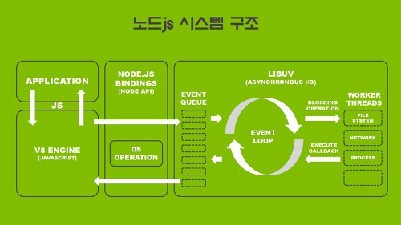

# Checklist

-   node.js는 어떤 식으로 동작하나요?

    -   `require()` 함수는 어떻게 쓰는 것인가요?
    -   `module.exports`와 `exports` 변수는 어떻게 다른가요?

-   npm이 무엇인가요?
    -   npm 패키지를 `-g` 옵션을 통해 Global로 저장하는 것과 그렇지 않은 것은 어떻게 다른가요?

# Node.js

## Node.js는 무엇일까?

### 개요

node.js는 오픈 소스, 크로스 플랫폼, 자바스크립트 런타임 환경으로서 자바스크립트 코드를 브라우저 밖에서 실행시키도록 해준다.

이전까지는 브라우저에 종속되어 있었던 자바스크립트가 node.js 환경을 만나면서 서버-사이드에서도 자바스크립트를 활용할 수 있게 되었다.

자연스럽게 "Javascript Everywhere" 페러다임을 대표하게 되었고, 웹-어플리케이션 개발에 있어서 더 이상 여러개의 언어가 아닌 언어 통일의 기회를 제공했다.

node.js는 이벤트 기반의 싱글 스레드로 비동기 I/O로 작동한다. 따라서 input/output 작업이 많거나, 실시간 웹어플리케이션에 유용하게 사용될 수 있다.

### 탄생

node.js를 만든 Ryan Dahl은 그때 당시에 가장 많이 활용되었던 웹-서버인 Apache HTTP Server가 대량의 동시 접속을 해결하는 방식을 비판해왔다.

코드가 실행되는 절차 속에서 대량의 동시 접속이 발생할 경우, 특정 코드가 전체의 프로세스를 BLOCK 하거나 많은 실행 스텍을 막는 등의 제한적인 면모를 비판해왔다.

이에 2009년 11월 8일, Common JS 기반, 그리고 구글의 V8엔진과 이벤트 루프, 그리고 low-level의 I/O API로 이루어진 node.js를 발표했다.

이후 2010년 Node.js의 환경을 위한 Package Manager인 NPM이 등장했다. 개발자들은 npm을 이용해 node.js 라이브러리를 더욱 쉽게 공유하고 설치하고 사용할 수 있게 되었다.

### Node.js로 할 수 있는 일

node.js를 활용하면 Javascript와 "Modules"를 이용해 웹 서버와 네트워킹 시스템을 만들 수 있다.

Modules는 다양한 핵심적인 기능을 제공하는 도구로서 file system I/O, Networking(DNS, HTTP, TCP, TLS//SSL, UDP), Buffers, Cryptography, Data streams 등과 같은 기능을 복잡하지 않도록 사용할 수 있도록 해준다.

node.js는 자바스크립트만을 기반으로 돌아간다. 그러나 compile-to-JS 가 가능한 언어라면 node.js로 구동이 가능하다. 예를 들어, Coffesccript, Dart, Typesciprt, Clojurescript 등.

node.js를 활용하면 "Event-Driven-Programming"을 활용한 빠른 웹 서버를 구축할 수 있다.

개발자는 이러한 "Event-Driven-Programming"의 단순화된 모델을 사용함으로써, Callback을 활용해 "Threading"[[1]](#threading)을 하지 않고도 스케일링이 가능한 서버를 만들 수 있다.

### Node.js 작동 방식

node.js는 싱글 스레드, 이벤트 루프 기반의 Non-Blocking I/O로 작동한다.

그렇기에 수만 개의 동시 접속에도 Thread Context Switch(스레드 문맥 교환)[[2]](#context-switch)을 발생시키지 않아도 된다.

Observer Pattern[[3]](#observer-pattern)을 사용하여 I/O 작업이 있는 함수를 Callback으로 작동시키는 하나의 스레드를 모든 요청이 함께 공유하게 되면 굉장히 높은 효율로 동기적인 어플리케이션이 작동할 수 있다.

node.js의 기본적인 시스템 구조를 살펴보면 다음과 같다.

node.js는 libuv라는 라이브러리를 사용해 이벤트 루프를 제어한다.

libuv란 C 언어로 개발된, 비동기 I/O에 집중하는 멀티 플랫폼 라이브러리이다.

libuv에는 thread pool 이라는 것이 존재해서, 여기에 있는 thread가 동기적인 입출력 작업을 event-loop 대신 처리를 해준다. 또한

만약 시스템적으로 Non-Blocking IO를 지원하지 않는 IO 호출이 있는 경우, 이를 비동기 처리 하기 위해, 내부의 Thread Pool(libio)를 별도로 이용해 처리한다.

Event-Loop는 가능하다면 최대한 시스템 커널에 작업을 넘겨 Non-Blocking I/O 작업을 수행할 수 있도록 한다. 이것을 풀어서 설명하자면,

    1. 메인 스레드는 테스크 큐에 테스크를 추가한다.
    2. 비동기로 작동하는 함수라면 kernel-side non-blocking sockets로 이전된다.
    3. 만약 동기로 작동한다면 해당 스레드에서 작동한다.
    4. 스레드 풀에 있던 테스크가 완료되면 메인 스레드에게 알리고 지정되어 있던 콜백 함수가 작동하게 된다.

이러한 싱글 스레드의 단점은 cluster, StrongLoop Process Manager, pm2와 같은 외부 모듈 없이는, 가동 중인 CPU 코어를 늘려 스레드의 갯수를 늘리는 것과 같은 scale up을 지원하지 않는다는 것이다.

하지만 개발자는 libuv 스레드 풀에 기본 스레드 수를 증가시킬 수는 있다.

다른 한가지 문제점은 굉장히 복잡한 컴퓨팅이나, CPU를 많이 써야하는 작업의 경우, 그것이 완료될 때까지 모든 event-loop가 멈춰있을 수 있다는 단점이 있다.

이 문제는 node.js 10 버전으로 들어오면서 Worker_thread 라는 모듈을 통해 thread 생성이 가능하게 되면서 어느 정도 해소할 수 있어 보인다.

그러나 내부적으로 프로세스를 나누는 것 자체도 CPU에게는 하나의 일이기 때문에 정말 하드한 CPU 작업이 아니라면 스레드를 나누는 것이 오히려 퍼포먼스를 더 저하시킬 수도 있다.

### require() 함수는 어떻게 사용하는가

Node.js는 Common.js의 모듈 시스템을 따른다. Common.js는 웹 브라우저 밖의 자바스크립트 모듈 생테계의 규칙을 설립하기 위한 프로젝트이다. 원래는 2009년 모질라의 개발자에 의해 `ServerJS`라는 이름으로 시작되었다. 후에 API의 더 넓은 적용 가능성을 나타내기 위해 CommonJS라는 이름으로 변경되었다. `require()` 함수는 CommonJS에서 모듈을 호출하기 위한 함수로서 사용된다.

`require()` 함수의 내부는 대략적으로 다음과 같이 작동한다. 우선 불러올 소스의 디렉토리를 인자로 받아, 해당 디렉토리의 파일을 읽고, 내부 변수에 저장한다. 그리고 module.exports 라는 빈 객체를 생성하고 거기에 읽어두었던 파일의 내용을 복사한다. 그리고 최종적으로 module.exports를 반환한다.

*import...from*과는 어떻게 다를까?

import는 ES6에서 지원하는 모듈 시스템이다. ES6 문법이기 때문에 바벨을 사용하지 않으면 브라우저 환경에서는 제약이 있다.

자바스크립트는 사실 브라우저에 의존적이었기 때문에 모듈 관리가 힘들었다. `<script>`를 활용해서 HTML에 삽입하는 방식으로 여러 개의 자바스크립트 파일을 사용할 수 있었는데, 이렇게 할 경우 모든 자바스크립트 소스도 결국 window 객체에 종속되기 때문에 중복되는 변수 등이 있는지 항상 확인해야하는 번거로움이 존재했다.

그래서 Node.js에서는 CommonJS를 이용해 `require()`를 이용해 모듈 관리를 쉽게 할 수 있다.

후에 ES6에서 `import`, `export` 와 같은 문법을 지원하기 시작하면서 자바스크립트 자체에서도 모듈을 활용할 수 있게 되었다.

`require()`과 `import...from`의 가장 큰 차이점은 이 둘의 기본적인 작동 방식일 것이다. `require()`은 동기적으로 작동한다. 그렇기 때문에 여러 개의 모듈을 호출해서 사용할 경우, 그리고 하나의 모듈의 크기가 클 경우 퍼포먼스에 문제가 생길 수도 있다. 하지만 `import`의 경우에는 비동기적으로 작동하기 때문에 앞선 상황에서는 물론이고 기본적으로 모듈을 호출하여 사용하는데 성능상 약간의 이점을 보인다.

또 `require()`는 특정 모듈을 모두 사용하기 때문에 만약 모듈의 속성이 모두 필요한 것이 아니라면 메모리의 낭비가 있을 수 있다. 하지만 `import...from`은 특정 속성만을 호출해서 사용할 수 있기 때문에 메모리의 이점이 있을 수 있다.

### `module.exports`와 `exports`는 어떻게 다를까

결국 `require` 함수는 객체를 반환하는 함수이다. 그렇다면 이렇게 함수를 호출해서 사용하기 위해 어떻게 모듈을 export 할 수 있을까.

우선 exports와 module.exports의 관계에 대해서, exports는 module.exports의 일종의 alias이다.

한마디로 exports와 module.exports는 `call by reference`로 같은 메모리 주소의 객체를 바라보고 있고, 최종적으로 반환되는 객체는 module.exports이다.

### Node Package Manager

npm은 node.js 서버 플랫폼을 위한 패키지 매니저이다. node.js 프로그램의 서드 파티를 설치하는 것을 관리하는 도구이다. 기본적으로 node.js를 설치하면 자동적으로 설치된다.

npm을 이용해 설치한다는 것은 설치하고자 하는 패키지를 현재 디렉토리 기준의 node 환경을 관리하는 package.json에 설치 된다. 만약 `npm installl .... -g`로 패키지를 설치하게 될 경우, 해당 패키지를 디렉토리 기준이 아닌 로컬의 node 저장소에 패키지가 다운 받아진다.

따라서 해당 패키지명과 관련하 `CLI`를 사용할 수도 있으며, 로컬 전역에서 해당 패키지를 사용할 수 있다.

---

<a name="threading">[1]</a> Thread: 프로그램 내, 프로세스 내에서 실행되는 흐름의 단위를 말한다. 일반적으로 한 프로그램은 하나의 스레드를 가지고 있다. 하지만 프로그램 환경에 따라 둘 이상의 스레드를 동시에 실행할 수 있다. 이러한 실행 방식을 멀티스레드라고 한다.

<a name="context-switch">[2]</a> Context Switch: 문맥 교환, 하나의 프로세스가 CPU를 사용 중인 상태에서, 다른 프로세스가 CPU를 사용하도록 하기 위해, 이전의 프로세스의 상태(문맥)을 보관하고 새로운 프로세스의 상태를 적재하는 작업. 한 프로세스의 문맥은 그 프로세스의 프로세스 제어 블록에 기록되어 있다. 문맥 교환이 일어나는 동안에는 유용한 적업을 수행할 수 없고 일종의 오버헤드가 발생한다.

<a name="observer-pattern">[3]</a> Observer Pattern: 옵서버 패턴은 객체의 상태 변화를 관찰하는 옵저버의 목록을 객체에 등록하고 상태 변화가 있을 때마다 메소드 등을 통해 객체가 직접 목록의 각 옵저버에게 통지하도록 하는 디자인 패턴이다. 주로 이벤트 핸들링 시스템을 구현하는데 사아ㅛㅇ된다.
