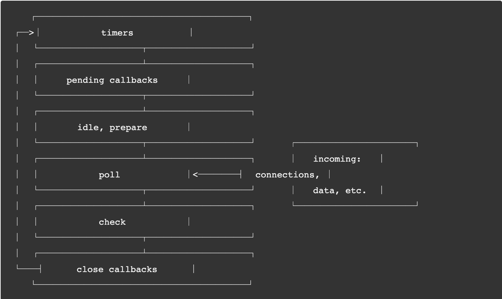

## Topics

-   expressJS
-   `setTimeout()`
-   AJAX, `XMLHttpRequest`, `fetch()`

## Checklist

-   어떠한 자바스크립트 코드가 HTTP 응답이나 사용자의 이벤트등에 종속되어 언제 실행되어야 할 지 알기 어려울 때엔 어떻게 해야 할까요?
-   브라우저의 `XMLHttpRequest` 객체는 무엇이고 어떻게 동작하나요?
-   `fetch` API는 무엇이고 어떻게 동작하나요?
    -   자바스크립트의 Promise는 어떤 객체이고 어떤 일을 하나요?
    -   자바스크립트의 `async`와 `await` 키워드는 어떤 역할을 하며 그 정체는 무엇일까요?

## Javascript, Asynchronous

C, Java, C#, Python 등과 같은 프로그래밍 언어는 기본적으로 동기적으로 작동한다. 물론 여러 개의 스레드를 이용해 새로운 프로세스를 만들어 비동기적으로 수행할 수도 있다.

Javascript도 마찬가지로 기본적으로는 동기적으로 작동한다. 하지만 Javascript는 브라우저에서 태동하여 `onClick`, `onMouseOver`, `onChange`, `onSubmit` 등과 같은 사용자의 행동에 반응하도록 만들어졌다.

사실 이와 같은 사용자의 행동은 언제 발생할지 예측하는 것이 거의 불가능하다. 그렇기 때문에 만약 특정 이벤트나, HTTP 응답과 같은 언제 발생할지 모르는 코드를 기다렸다가 다음 코드로 진행하는 동기적인 방식은 매우 비효율적일 것이다.

그래서 자바스크립트는 비동기적으로 코드를 처리해 이와 같은 비효율성을 극복하고자 했다. 하지만 만약 function A가 비동기로 작동하고 해당 함수의 반환 값을 이용하는 function B가 있다고 가정한다면 function A가 값을 반환하는 것을 기다리지 않고, 바로 function B를 실행해버리는 것이 비동기로 작동할 경우에 주의해야할 점이다.

이러한 문제를 해결하기 위한 것이 Callback이다.

Callback을 살펴보기 전에 자바스크립트가 비동기로 작동할 수 있도록 도와주는 Event Loop에 대해 알아보도록 하겠다.

-   ## Event Loop

    자바스크립트는 싱글 스레드로 동작한다. 하지만 Non-Blocking I/O 작업을 가능하도록 해주는 Event Loop를 통해 효율적으로 비동기 작업이 가능하다.

    대부분의 모던 커널은 멀티 스레드를 지원한다. 그래서 여러 개의 작업을 백그라운드에서 다룰 수 있다. 만약 그 중 하나의 작업이 완료되면 커널은 Node.js에게 작업이 완료되었음을 알리고 적합한 콜백 함수는 `poll` 큐에 추가되어 실행될 수 있도록 한다.

    Node.js가 시작되면 Event Loop도 자동으로 시작된다. 그리고 주어진 Input Script, 예를 들어 async API, schedule timers, process.nextTick()를 발생시키는 작업들을 Event Loop에서 시작한다.

    

    위의 그림은 Event Loop의 작동 순서에 대한 대략적인 표현이다. 각각의 박스는 Event Loop의 "phase"라는 것이다.

    각각의 phase는 FIFO(First In First Out) 큐로 콜백 함수를 작동시킨다.

    Event Loop가 각각의 phase에 도달하게 되면 해당 큐에 있는 작업들을 수행하기 시작하는데, 큐가 모두 소진될 때까지 혹은 최대로 실행될 수 있는 만큼 콜백을 실행하게 되면 Event Loop는 다음 phase로 넘어가게 된다.

    작업을 실행하는 도중, 새로운 작업이 더 생길 수도 있고 혹은 커널에 의해 새로운 이벤트가 `poll` phase에 추가될 수 있다. 그렇기에 오래 걸리는 콜백이 있을 경우엔 timer의 시작점보다 더 오래 걸릴 수도 있다.

    -   ### Phase 살펴보기

        -   timers: 이 phase는 `setTimeout()`이나 `setInterval()`에 의해 예약된 콜백을 실행한다.
        -   pending callbacks: 다음 루프의 반복으로 인도된 I/O 콜백을 실행한다.
        -   idle, prepare: idle은 매 tick(phase to phase)마다 실행, prepare은 매 polling마다 실행
        -   poll: 새로운 I/O 이벤트를 받고, I/O와 연관되어 있는 콜백을 실행한다(거의 대부분의 콜백. 단, `close callbacks`, `timers`, `setImmediate()`는 예외).
        -   check: `setImmediate()` 콜백이 실행된다.
        -   close callbacks: close callbacks, 예를 들어 `socket.on('close', ...)`

    -   ### 대략적인 작동 방식

        ```js
        const fs = require('fs');

        function asyncOperation(callback) {
            fs.readFile('test.txt', callback); // 이 작업은 95ms가 소요된다고 가정
        }

        const timeoutScheduled = Date.now();

        setTimeout(() => {
            const delay = Date.now() - timeoutScheduled;

            console.log(`${delay}ms have passed since I was scheduled`);
        }, 100);

        asyncOperation(() => {
            const startCallback = Date.now();
            // 10ms 가 소요되는 작업을 수행

            while (Date.now() - startCallback < 10) {}
        });
        ```

    만약 위와 같은 코드가 있다고 가정해보자.

    우선 메인 스레드에서 위 코드를 차례대로 읽어드리기 시작한다. 그러다가 비동기 작업을 만날 경우 _(위의 경우에는 `fs.readFile()`)_ libuv를 통해 Event Loop로 해당 테스크를 던진다.

    해당 테스크는 `poll` phase로 들어온다.

    아직은 큐가 비어있다. 그리고 가장 가까운 시일에 실행되는 timer까지 남은 시간동안 기다린다.

    기다리는 동안, 95ms가 흐르고 파일을 읽는 작업이 완료되면 이에 대한 콜백으로 10ms가 소요되는 작업이 `poll` 큐에 추가되며 실행된다.

    콜백 함수가 끝나게 되면 Event Loop는 가장 가까운 시일에 실행되는 timer의 시간에 도달했다는 것을 알게 되고, `timer` phase로 돌아가 timer에 있는 콜백을 실행하게 된다.

    결과적으로 위의 코드를 실행하게 되면 약 105ms의 시간이 흘렀다는 것을 알 수 있다.

-   ## Callbacks

    콜백은 특정 이벤트가 발생될 때만 호출이 되는, 어떠한 함수의 인자로 주어지는 함수를 말한다.

    위의 예시로 살펴보면, 콜백을 통해 function A가 끝났을 경우에만 function B가 실행되도록 만드는 것이 가능하다.

    하지만 콜백은 항상 nesting을 동반하게 되는데, 연관되어 있는 여러 개의 콜백이 필요할 경우에 코드가 생각보다 쉽게 복잡해질 가능성이 농후하다.

    그래서 등장한 것이 Promise이다.

    기본적인 생김새는 다음과 같다.

    ```js
    const promise = new Promise((resolve, reject) => {
        if (/* Everything turned out fine */) {
            resolve("Stuff worked!");
        } else {
            reject(Error("It broke"));
        }
    })
    ```

    `Promise` 객체는 다음과 같은 일종의 상태를 갖는다. `fulfilled`, `rejected`, `pending`, `settled`. 각각은 `성공`, `실패`, `진행 중`, `완료`를 의미한다.

    위의 코드에서 만약 정상적으로 어떤 작업이 이루어지게 되면 인자로 받았던 함수의 첫번째 인자인 resolve를 실행하게 된다. 그리고 만약 실패하게 될 경우, 두번째 인자인 reject를 실행하게 된다.

    위의 `Promise`를 실행히키려면 다음과 같은 하면 될 것이다.

    ```js
    promise.then(
        result => console.log(result), // "Stuff worked!"
    ).catch(error => console.log(error) // Error: "It broke");
    ```

    `.then`을 이용해 `Promise`에 들어갈 `resolve`에 주었던 인자를 `result`로 받아올 수 있다. 그리고 `.catch` 구문으로 사용해 `reject`되었을 때의 인자를 error로 받아와 처리할 수도 있다.

    `Promise`의 특이한 점은 같은 비동기에 관한 구조들 중, micro task queue를 사용하기 때문에 일반적인 비동기보다 우선적으로 처리된다는 것이다.

## XMLHttpRequest

-   ### AJAX

    XMLHttpRequest(XHR)을 이야기하기에 앞서 AJAX를 알아보려 한다.

    먼저 AJAX란 "비동기 자바스크립트, XML" 이란 뜻이다. Asynchronous Javascript and XML.

    다시 말해 서버와 비동기적으로 통신하기 위해 XHR 객체를 활용한다는 것을 의미한다.

    XML만 한정되는 것은 아니고, JSON, XML, HTML, Text 등 다양한 포멧을 주고 받을 수 있다.

    AJAX를 활용하면 전체 페이지를 모두가 아닌 부분적으로 로드하는 것이 가능해진다.

    기존의 서버에서 사용자와 브라우저의 상호작용에 따라 정보가 오갈 때 모든 데이터를 한번에 보내주게 되면, 실질적으로 바뀐 내용이 거의 없더라도 그 사이 기다리는 시간은 항상 있기 마련이다.

    이러한 비효율성을 AJAX 엔진이 비동기로 처리하게 된다.

    AJAX를 사용하게 되면 우선 웹페이지의 속도가 향상된다. 모든 데이터가 아닌 부분적으로 변화가 있는 데이터를 비동기로 수신하기 때문에 사용자가 다른 일을 할 수 있다.

    또한 이러한 점을 활용한 사용자와 다양하게 상호작용할 수 있는 UI를 만들어낼 수도 있다.

    그렇다면 AJAX를 사용했을 경우의 단점은 연속적으로 서버에 요청을 보낼 경우, 서버에 부하가 걸릴 수 있다는 점이다.

    두번째로는 비동기로 작동하기 때문에 사용자가 현재 요청한 작업이 어디까지 되었는지, 얼마나 기다려야 하는지를 전혀 알 수가 없다. 따라서 예측 불가능한 액션을 취할 가능성도 생긴다.

    그렇다면 과거에는 어떤 방식으로 비동기 통신을 했을까. 놀랍게도 처음 AJAX와 같은 기능을 제공한 것은 바로 MS이다.

    1999년 발표된 IE5에서부터 `Microsoft.XMLHTTP`라는 컴포넌트가 현재의 AJAX와 거의 비슷한 개념으로 사용되었다. 이 컴포넌트는 브라우저의 고유 스펙이 아닌 윈도우에 탑재된 ActiveX를 호출해서 써야 하는 비표준 기술이었으며 무거운 http로 무거운 xml을 받아온다는 사실 때문에 인기가 있지는 않았다.

    하지만 Netscape와 같은 경쟁사들은 이러한 기능을 지원하지 않았기 때문에 실시간 채팅을 위해 어쩔 수 없이 사용되기 시작했다.

    시간이 흘러 Mozilla가 등장하고, Gecko 엔진에 XMLHttpRequest가 추가되면서 본격적으로 사용되기 시작했다.

    그러다가 Google이 연달아 Gmail, Google Map과 같은 어플리케이션을 아무런 플러그인 없이 AJAX로 구현하면서 엄청난 화제가 되었다.

    이후 Ajax 기술은 현대 웹 사이트의 근간 기술이라고 봐도 될 정도로 엄청난 영향을 끼쳤다.

    Ajax는 '양방향' 기술이 아니며, '요청-응답' 사이클이 지나면 통신 소켓을 닫아 버린다. 따라서 완전한 실시간 통신을 지원하기 위해 '웹소켓'이라는 새로운 기술이 구현되었다. '웹소켓'은 HTTP에 약간의 변형을 가해 소켓을 닫지 않고 계속해서 요청을 송수신할 수 있도록 만든 것이다.

    '웹소켓'은 TCP 기반이기 때문에 대규모 실시간 데이터 전송에는 적합하지 않다. 따라서 UDP 기반의 WebRTC라는 기술이 구현되었다. WebRTC는 한발 더 나아가 브라우저 간의 P2P 통신 채널을 형성하는 기능도 가지고 있다.

-   ### XMLHttpRequest

    AJAX가 일어나는 과정을 간략하게 나열하자면,

    1. XMLHttpRequest Object를 만든다.
    2. 서버에서 response가 왔을 때 실행될 callback 할수를 지정한다.
    3. open() 메소드를 사용하여 브라우저에게 request에 필요한 정보를 넘긴다.
    4. send()

    먼저 XHR은 웹 브라우저와 웹 서버 간에 메소드가 데이터를 전송하는 객체 폼의 API이다. 이 객체는 브라우저의 자바스크립트 환경에 의해 제공된다.

    AJAX를 위해 먼저 객체를 생성한다.

    ```js
    const xhr = new XMLHttpRequest();
    ```

    이어서 비동기적으로 작동할 callback 함수를 지정한다. 여기서 주의할 점은 서버에서 어떠한 응답이 올지 알 수 없기 때문에 이것에 대응하는 프로그램이 필요하다는 것이다. 이때 사용하는 것이 `onreadystatechange`이다. 이 이벤트는 AJAX Request에 어떠한 변화라도 생기면 작동한다.

    `onreadystatechange`는 XMLHttpRequest Object의 readyState라는 property에 변화가 생길 때 발동된다.

    state의 변화는 다음과 같이 이루어진다.

    ```
    0       request가 시작되지 않음
    1       request가 준비됨
    2       request가 전송됨
    3       request가 진행 중
    4       request가 완료
    ```

    `open( method, URL, asynchronous, username, password)`

    XHR을 사용하는 HTTP와 HTTPS 요청은 open 메소드를 통해 시작할 수 있다. 요청을 실질적으로 시작하기 전에 호출되는 것으로 `method, URL, URI user Information` 등을 지정할 수 있다.

    `open()`이 실행되면 readyState는 1로 바뀌게 된다. `send()`이 발생하면 `readyState`가 2로 바뀐다. 이후 response의 내용이 load되기 시작하고 `readyState`는 3이 된다. response의 content가 완전히 load되면 `readyState`는 4로 바뀌게 된다.

    ```js
    const xhr = new XMLHttpRequest();

    xhr.onreadystatechange = () => {
        const DONE = this.DONE || 4;

        if (this.readyState === DONE) {
            if (this.status === 200) {
                // Do something
            }
        }
    };

    xhr.open('GET', 'http://www.kwnore.com/', true);
    xhr.setRequestHeader('X-Requested-With', 'XMLHttpRequest'); // 서버에게 ajax로 요청을 보낸다는 의미이다. jquery/prototype/dojo와 같은 라이브러리들은 이를 이용한다.
    xhr.send();
    ```

    위의 코드와 같은 형태로 `onreadystatechange` 메소드를 사용해서 서버에서 response가 올때마다 대응할 수 있는 로직을 생성할 수 있다. 하지만 여전히 서버에서 어떠한 오류가 전송되는지 등의 여부는 알기 힘들다. 따라서 XMLHttpRequest의 status(혹은 statusText) property를 사용해서 응답의 상태를 체크할 수 있다.

## FETCH API

`fetch API`는 네트워크 통신을 포함한 리소스 취득을 위한 인터페이스이다. `XMLHttpRequest`와 같은 비슷한 API가 존재하지만, fetch는 좀 더 강력하고 유연한 조작이 가능하다.

앞서 `XMLHttpRequest`가 콜백 헬의 가능성을 내포하고 있는 것에서 `fetch`는 native Javascript API로 조금 더 향상되었다고 생각하면 된다.

`fetch`의 핵심은 HTTP `Request`, `Response`, `Headers`, `Body`의 추상화된 인터페이스이다. `fetch()`를 호출하게 되면 `Promise` 객체를 반환한다. request의 성공, 실패 여부를 떠나 해당 통신에 대한 `Response` 객체가 취득된다.

Promise 객체를 반환하기 때문에 `resolve`와 `reject`에 해당하는 함수를 지정해줘야 한다는 것이 특징이다.

fetch API가 반환하는 `Response` 객체는 여러가지 멤버 변수와 멤버 함수를 갖고 있다. 대표적으로 `ok`, `status`, `statusText`는 응답에 대한 상태를 평가하는데 사용된다.

```js
fetch('http://www.knowre.com/')
    .then(response => {
        // Do something
    })
    .catch(error => {
        // Do something
    });
```

fetch API는 두번째 인자로 `init` 객체를 받는데 이것을 통해 다양한 세팅을 할 수 있다. full option은 다음과 같다.

```js
fetch('url', {
    method: 'POST',
    mode: 'cors',
    cache: 'no-cache',
    credentials: 'same-origin',
    headers: {
        'Content-Type': 'application/json'
    },
    redirect: 'follow',
    referrerPolicy: 'no-referrer',
    body: JSON.stringify({})
});
```

그렇다면 `fetch`api가 반환하는 `Promise`란 무엇일까

-   ### Promise

`Promise`가 등장한 가장 큰 이유는 콜백 함수로 꼬여버린 함수를 해결하기 위함이다. 또한 몇 가지 이유, 장점이 있다.

비동기 처리는 함수에서 처리된 결과값을 반환할 경우, 해당 비동기 함수에서 찾을 수 밖에 없어 코드가 복잡할 경우 어려움이 있다. 반면 `Promise`는 구조가 비교적 간단해 반환값을 찾아 사용하기가 쉽다.

비동기 처리를 위한 콜백 패턴이 마치 비동기 함수처럼 처리 순서를 보장하는 것은 아니다. 하지만 `Promise`를 활용하면 함수의 처리 순서를 어느 정도 보장할 수 있다.

마지막으로 에러 처리가 조금 복잡하다. 예를 들어,

```js
try {
    setTimeout(() => {
        new Error('Error!');
    }, 1000);
} catch (err) {
    console.log('ERROR: ', err);
}
```

이런 코드가 있다고 가정한다. 콜백 함수는 해당 이벤트가 발생하면 Task queue로 이동한 후에 Call Stack이 비어지면 Call Stack으로 이동되어 실행된다.

setTimeout 함수는 비동기 함수이기 때문에 콜백 함수를 기다리지 않고, 실행 즉시 Call Stack에서 제거된다. 이후 Error가 발생하면 Caller 방향으로 전파되어야 하는데, 이미 setTimeout은 Call Stack에 존재하지 않기 때문에 catch 문에서 잡히지 않고 프로세스는 종료된다.

이런 문제를 해결하기 위해 `Promise`가 제안되었다.

`Promise`는 비동기 연산이 종료된 이후의 결과값이나 실패 이유를 처리하기 위한 처리기를 연결할 수 있도록 한다. 그래서 비동기 메소드를 마치 동기 메소드처럼 사용할 수 있게 된다.

`Promise`는 다음 중 하나의 상태를 가진다.

-   pending: 이행하거나 거부되지 않은 초기 상태
-   fulfilled: 연산이 성공적으로 완료됨
-   rejected: 연산이 실패함


프로미스를 활용해 XMLHttpRequest 객체를 효율적으로 처리할 수 있다.

```js
function promisifiedAjax(method, url, payload) {
    return new Promise((resolve, reject) => {
        const xhr = new XMLHttpRequest();

        xhr.open(method, url);
        xhr.setRequestHeader('Content-type', 'application/json');
        xhr.send(JSON.stringify(payload));

        xhr.onreqdystatechange = () => {
            if (xhr.readyState !== XMLHttpRequest.DONE) return;

            if (xhr.status > 200 && xhr.status < 400) {
                resolve(xhr.response);
            } else {
                reject(new Error(xhr.status));
            }
        };
    });
}
```

`Promise`의 등장으로 전보다는 나아졌지만 아직 비동기가 들어간 비즈니스 로직이 중첩될 수록 복잡도가 큰 폭으로 상승하는 문제는 여전했다. 이에 따라 `Promise`와 `Generator`를 활용한 `async-await`가 새로운 스펙으로 도입되었다.

-   ### Async-Await

실제로 Babel에 `async-await`를 컴파일 해보면 `async`는 `generator`로, `await`는 `yield`로 바뀐다.

`Generator` 제너레이터는 함수의 실행을 중간에 멈추었다가 필요한 시점에 다시 재개할 수 있도록 만드는 일종의 코루틴이다. 하지만 코루틴과는 다르게 멈출 때 돌아갈 위치를 직접 지정할 수 없고, 호출자에게 제어권을 넘겨주게 된다. 예를 들어 아래와 같다.

```js
function* gen() {
    const x = yield 1;
    const y = yield x + 1;
    const z = yield y + 2;

    return x + y + z;
}

const itr = gen();
console.log(itr.next()); // { value: 1, done: false }
console.log(itr.next(10)); // { value: 11, done: false }
console.log(itr.next(20)); // { value: 22, done: false }
console.log(itr.next(30)); // { value: 60, done: true }
```

위의 제너레이터는 실행될 때 이터레이터를 반환한다. 그리고 `next()` 함수가 호출될 때마다 호출되는 곳의 위치를 기억해둔 채로 실행된다. 그리고 함수 내부에서 `yield`를 만날 때마다 기억해둔 위치로 제어권을 넘겨준다.

여기서 `function* ()` => `async function ()` 그리고 `yield` => `await`이렇게 바뀐 것이다. 이제 `co`와 같은 라이브러리 없이도 마치 비동기 코드를 작성하듯 프로그래밍 할 수 있다.

그렇다면 async-await를 어떻게 generator를 활용해서 구현했을까?

```js
// ES 7
async function foo() {
    await bar();
}
```

이처럼 간단한 async-await 구문을 ES5 식으로 컴파일하면 다음과 같다.

```js
// ES 5
let foo = (() => {
    var _ref = _asyncToGenerator(function*() {
        yield bar();
    });

    return function foo() {
        return _ref.apply(this, arguments);
    };
}());

function _asynctToGenerator(fn) {
    return function() {
        var gen = fn.apply(this, arguments);

        return new Promise(function(resolve, reject) {
            function step(key, arg) {
                try {
                    var info = gen[key](arg);
                    var value = info.value;
                } catch (error) {
                    reject(error);

                    return;
                }

                if (info.done) {
                    resolve(value);
                } else {
                    return Promise.resolve(value).then(
                        function(value) {
                            step('next', value);
                        },
                        function(err) {
                            step('throw', err);
                        }
                    );
                }

                return step('next');
            }
        });
    };
}
```

위의 예시는 babel에서 async-await를 구현한 것인데 역시 async-await 구문을 generator를 활용해서 구현했다는 것을 알 수 있다.

`_asyncToGenerator` 함수 내에서 인자로 받은 제너레이터 함수를 실행하고, iterator 객체를 클로저로 저장해둔다. 나머지는 클로저에 저장한 iterator를 실행시키고, 반환된 promise 객체를 재귀함수를 통해 (step) 반복해서 실행시켜준다.

정리해서 `Generator`는 비동기적인 패턴을 yield 구문을 통해서 동기적인 프로그래밍 형태로 바꾸어주고, `Promise`는 `Generator`가 생성한 `Iterator` 객체를 반복해서 실행시켜준다.
