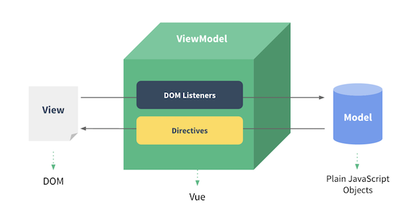
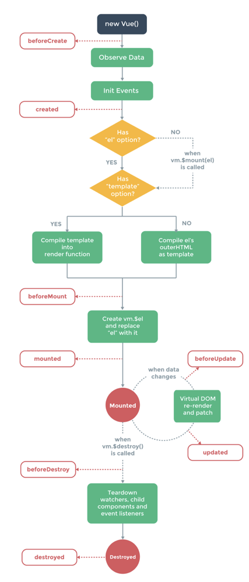

# Quest 16. Vue.js

## Introduction

-   이번 퀘스트에서는 Vue.js 프레임워크를 통해 현대적인 웹 클라이언트를 개발하는 법을 알아보겠습니다.

## Topics

-   Components in web client development
-   Vue.js framework
-   Virtual DOM

## Checklist

-   Vue.js는 어떤 특징을 가지고 있는 웹 프레임워크인가요?
-   Vue.js에서의 컴포넌트란 무엇인가요?
-   컴포넌트 간에 데이터를 주고받을 때 단방향 바인딩과 양방향 바인딩 방식이 어떻게 다르고, 어떤 장단점을 가지고 있나요?

## Components in Web Client Development

웹 클라이언트에서 컴포넌트란 HTML, CSS, Javascript와 같은 기술들을 캡슐화하여 웹 앱에서 활용할 수 있는 일종의 커스텀 엘리먼트를 말한다.

개발에 있어서 중복된 코드의 사용을 줄이고, 최대한 재사용성을 극대화하는 것이 효율적일 것이다. 웹 클라이언트에서는 이와 같은 효율성을 발휘하기가 상대적으로 힘든데 그 이유는 전통적인 마크업 구조의 특성 때문이다. UI를 렌더링하기 위해 HTML, CSS를 복잡하게 작성해야 하며, 이에 따른 Javascript 코드도 자칫 잘못하면 복잡하게 엉켜버리기 쉽다.

웹 컴포넌트는 이러한 현상에서 조금 더 자유로워지기 위해 나타난 기술로, 각 코드들을 캡슐화해서 다른 여러 곳에서 충돌을 방지하고 다양한 기능을 갖춘 커스텀 엘리먼트로서의 역할을 수행시킨다.

기본적으로 웹 컴포넌트는 3가지 기술들로 구성되어 있다.

첫째로 커스텀 엘리먼트는 엘리먼트와 그 동작을 정의할 수 있도록 해주는 Javascript API 세트로 사용자 인터페이스에서 원했던대로 사용될 수 있다.

둘째로 Shadow DOM은 메인 도큐멘트 DOM에서 각각 렌더링되는 엘리먼트로 캡슐화해준다. 이 방식으로 통해 캡슐화된 엘리먼트의 기능 및 코드들을 충돌 걱정 없이 독립적으로 관리할 수 있도록 해준다.

샛째로 HTML template, `<template>` 등의 태그를 이용해서 실제 렌더되지는 않는 마크업 템플릿을 엘리먼트를 생성할 수 있다. 이를 활용해 엘리먼트를 재사용할 수 있다.

## Vue.js framework

vue.js는 프론트엔드 프레임워크 중 하나이다. 여타 다른 프론트엔드 프레임워크보다 배우기가 쉽고, 가볍고 빠르다고 하는데 왜 그런지 조금씩 알아보아야겠다.



vue.js는 MVVM 모델에서의 ViewModel을 담당한다. 웹페이지에서 DOM(View)과 자바스크립트(Model)의 조합으로 렌더링되는데, VM이 없는 상태에서는 API를 활용해서 직접 모델과 뷰를 연결한다. 여기서 중간에 ViewModel의 역할을 하는 Vue.js를 삽입하여 뷰와 모델 사이의 연관성을 없애버리고 자바스크립트 객체와 돔을 연결해주는 것은 물론 서버와의 데이터 통신까지 독립적으로 수행한다.

React의 가상돔처럼 Vue.js에도 가상돔이 있다. 돔 요소가 많아지면 자바스크립트로 돔을 다루는 것이 무거워진다. 그래서 돔과 비슷한 메모리에 올라가 있는 가상돔을 만들어서 빠른 속도로 수정을 처리할 수 있다. 그래서 가상돔에 수정이 일어날 때마다 진짜 돔과 비교해서 차이가 발생한 부분만 수정한다.

Vue.js에서의 컴포넌트는 커스텀 엘리먼트와 비슷한 형태를 갖는다. `<hello />`와 같은 형태의 엘리먼트를 만들 수 있으며 이러한 커스텀 엘리먼트에 데이터를 넣을 수도 있고, 이벤트를 받을 수도 있다.

Vue.js는 단일 파일 컴포넌트를 주로 사용되기 때문에 한 파일 안에 HTML, Javascript, CSS가 모두 함께 있는 형태이다. 심지어 CSS까지 빌드 시점에 고유한 셀렉터 이름으로 대체되어 다른 컴포넌트와 충돌이 일어나지 않는다.

Vue.js의 컴포넌트는 하나의 인스턴스이다. 그래서 먼저 뿌리가 될 하나의 Vue 컴포넌트를 생성하는 것으로 시작된다.

```vue
<div id="app">{{ msg }} </div>

<script>
const vm = new Vue({
    el: '#app',
    data: {
        msg: 'Hello World',
    },
});
</script>
```

위 코드에서 Vue 생성자 함수로 뷰모델을 만드는데 이것 역시 Vue 인스턴스이다. 이 뷰모델과 연결될 내부의 템플릿을 지정할 수 있는데, 그것을 `el: '#app'`으로 지정할 수 있다.

`data` 객체는 인스턴의 상태를 저장하는 역할을 하는데 템플릿에 바인딩할 데이터들의 집합이다. 위 코드에서는 msg라는 변수의 값을 `data` 객체에서 바인딩하여 출력했다.

뷰 인스턴스에는 methods 객체도 있는데, 이것은 인스턴스의 메소드의 집합이다. 주로 돔에 연결할 이벤트를 다루는데 활용된다. 예를 들어 다음과 같이 활용할 수 있다.

```vue
<div id="app">
    <button v-on:click="onClick">클릭!</button>
</div>

<script>
var vm = new Vue({
    el: '#app',
    methods: {
        onClick: () => alert('Hello World!'),
    },
});
</script>
```

이런 방식의 이벤트 바인딩에서 한발 더 나아가 computed 객체를 활용해 methods 객체와 비슷한 역할은 하지만 캐쉬를 활용해 함수 본문에서 사용하는 상태값에 변화가 없으면 함수를 수행하지 않고 저장한 캐쉬값을 반환하는 기능도 있다.

```vue
<div id="app">{{ msg }}</div>

<script>
var vm = new Vue({
    el: '#app',
    data: { name: 'Chris' },
    computed: {
        msg: () => `Hello, ${this.name}`,
    },
});
</script>
```

인스턴스의 라이프 사이클은 크게 생성 => 마운트 => 소멸로 다음과 같다.



beforeCreate => created => beforeMount => mounted => (beforeUpdate => updated) => beforeDestroy => destroyed

위와 같은 큰 줄기의 이벤트 사이클에서 각각의 시점마다 이벤트 훅을 사용할 수 있다.

~~Vue.js는 양방향 데이터 바인딩을 사용한다. 컴포넌트를 만들 수 있기 때문에 부모 컴포넌트와 자식 컴포넌트가 생겨나게 되는데, 이러한 트리 구조가 생기면서 각 컴포넌의 데이터 교류에 대한 흐름을 말한다.~~  
~~기본적으로 데이터는 부모 => 자녀 한 방향으로만 전달된다. 이것은 React의 단방향 데이터 흐름과 같다. 따라서 React에서처럼 부모 컴포넌트에서 자식 컴포넌트에게 데이터를 전달해 출력할 수 있다.~~

Vue.js는 데이터 바인딩이라는 것은 각 컴포넌트 간의 관계를 이야기하는 것이 아니다. View <=> View Model 사이에서의 관계를 이야기 하는 것이다. Vue.js가 양방향 데이터 바인딩을 지원한다는 것은 `v-model`을 사용해 자바스크립트 객체와 실제 DOM 엘리먼트가 항상 동기화되어 있다는 것을 의미한다. 반면, React 같은 경우는 양방향 데이터 바인딩을 지원하지 않기 때문에 자바스크립트 객체와 실제 DOM 엘리먼트 사이의 데이터 동기화를 위해 추가적인 작업이 필요하다.

```vue
<Child name="Chris"></Child>

<script>
Vue.component('Child', {
    el: '#child',
    props: ['name'],
});
</script>
```

위 코드에서 Child 컴포넌트는 부모의 'name' 속성의 값을 데이터로 받아 출력한다.

한편, 자녀 => 부모로는 데이터 전달은 불가능하지만 이벤트를 emit(발생)하면서 부모에게 이벤트를 전달할 수 있다.

```vue
<Child v-on:typed="onTyped"></Child>

<script>
Vue.component('NameForm', {
    el: '#child',
    methods: {
        onClick: function () {
            this.$emit('typed');
        },
    },
});
</script>
```

위 코드에서 chlid 컴포넌트에 "typed" 이벤트가 emit 발생하게 되면 부모 클래스로 해당 이벤트를 전달해준다. 그러면 부모 컴포넌트의 onTyped 메소드가 실행된다.

위에서 사용한 바인딩은 `v-on:typed`인데, 이외에도 여러가지 바인딩의 종류가 있다.

-   인터폴레이션 : {{ }} instance => template
-   프로퍼티 : v-bind:property, instance => template
-   어트리뷰트 : v-bind:attribute, instance => template
-   클래스 : v-bind:class instance => template
-   스타일 : v-bind:style instance => template
-   이벤트 : v-on, template => instance
-   양방향 데이터 바인딩 : v-model

-   ### 컴포넌트끼리 데이터를 주고 받을 때 양방향과 단방향은 어떻게 다를까.

Vue.js에서 양방향 데이터 바인딩이라는 것은 위에서 말했듯이 DOM과 자바스크립트 객체 사이에서의 뷰모델로서 항상 DOM과 JS를 일치시켜준다는데 의미가 있다. 예를 들어 input 태그에 어떤 값을 입력하게 되면 DOM에 변화가 일어남과 동시에 JS에도 해당 DOM과 바인딩 시켜놓은 변수에 변화가 생긴다.

위의 바인딩 예시에서 `instance => template`은 뷰 인스턴스의 데이터 값을 HTML 상의 템플릿에 데이터를 바인딩한다는 의미이다. 이것이 단방향 데이터 바인딩의 기본적인 작동 방식이다. 여기서 Vue.js는 `template => instance`로 이벤트를 전달해주고, 더 나아가 `v-model`이라는 디렉티브도 제공한다.

대표적인 예시가 input 태그에 폼 입력하는 것이다.

```vue
<div id="app">
    <input type="text" v-model="name" />
    {{ name }}
</div>
; new Vue({ el: '#app', data: { name: 'Hello', }, });
```

이렇게 `v-model`을 설정함으로써 input 태그에 값을 입력할 때 뷰인스턴스에 dta를 바로 변경시킬 수 있다.

단방향 데이터 바인딩을 사용하게 되면 데이터가 한 방향으로만 흐르기 때문에 하위 컴포넌트가 부모의 상태를 변경하는 것이 다른 조치를 취하지 않고서는 불가능하다. 따라서 데이터의 흐름을 추론하기는 더 쉽다. 하지만 동시에 단점으로도 작용할 수 있는데 컴포넌트 간의 데이터 전달에 항상 특정 로직이 들어가야 한다는 것이다.

양방향 데이터 바인딩은 인스턴스가 템플릿의 값을 변경시킬 수 있다. 따라서 뷰와 모델의 값이 항상 동일하게 되고, 다르게 말하면 데이터와 화면이 항상 동일하다(단방향 데이터 바인딩에서는 이와 같은 효과를 내기 위해서 다른 작업을 해주어야 한다). 하지만 데이터 변경이 일정하지 않기 때문에 디버깅 시 어려움이 있을 수 있고, 변경되는 데이터를 감지하기 위해서 내부적으로 추가적인 작업이 들어가기 때문에 성능에 있어서 문제가 생길 수도 있다.
